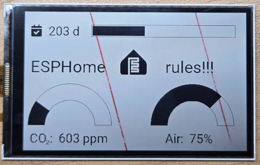

# ESPHome Component for Sharp Memory LCD (LS032B7DD02)

## 📌 Overview

This is a custom [ESPHome](https://esphome.io/) component for controlling the **Sharp Memory LCD LS032B7DD02** — a 3.2" 336×536 pixel reflective display with low power consumption and high readability.

## 🔌 Wiring Example

You need only 3 GPIOs to connect the display.

| Pin # | LCD Pin  | ESP32 Pin | Notes                   |
|-------| ---------|-----------|-------------------------|
|   1   | SCLK     | GPIO14    | SPI Clock               |
|   2   | SI       | GPIO13    | SPI Data                |
|   3   | SCS      | GPIO18    | Chip Select             |
|   4   | EXTCOMIN | GND       | VCOM toggle pin         |
|   5   | DISP     | 3V3       | Display ON/OFF control  |
|   6   | VDDA     | 5V        | 5V                      |
|   7   | VDD      | 5V        | 5V                      |
|   8   | EXTMODE  | GND       | VCOM mode               |
|   9   | VSS      | GND       | Ground                  |
|  10   | VSSA     | GND       | Ground                  |

> ⚠️ Replace GPIO numbers as needed in your ESPHome config. Try to use HW SPI pins for `SCLK` and `SI`

> ℹ️ This component uses software-defined VCOM, so EXTCOMIN input is not needed and can be connected to ground. DISP can be also connected to 5V instead of 3V3 if needed.

## 🛠️ Installation

1. Add the custom component to your ESPHome project:

```yaml
external_components:
  - source:
      type: git
      url: https://github.com/Sl-Alex/esphome-components
    components: [ls032b7dd02]
```

2. Configure the display:

```yaml
font:
  - file: "gfonts://Roboto"
    id: roboto_50
    size: 50

spi:
  clk_pin: 14
  mosi_pin: 13

display:
  - platform: ls032b7dd02
    id: my_display
    cs_pin: 27
    lambda: |-
      it.set_rotation(DISPLAY_ROTATION_270_DEGREES);
      it.print(5, 50, id(roboto_50), "ESPHome :)");
```

## 🧪 Example Project

Here is a very simple example of what you can get:



Here is a full YAML configuration for this example:

```yaml
esphome:
  name: esp-dashboard
  friendly_name: ESPHome dashboard

esp32:
  board: nodemcu-32s
  framework:
    type: esp-idf

# Enable logging
logger:

# Enable Home Assistant API
api:
  encryption:
    key: "<YOUR RANDOM ENCRYPTION KEY>"

ota:
  - platform: esphome

wifi:
  ssid: !secret wifi_ssid
  password: !secret wifi_pwd

  # Enable fallback hotspot (captive portal) in case wifi connection fails
  ap:
    ssid: "ESP Dashboard Fallback Hotspot"
    password: "<YOUR FALLBACK PASSWORD>"

captive_portal:

image:
  grayscale:
    # Taken from https://dashboardicons.com/icons/esphome
    - file: "esphome.svg"
      id: esphome_logo
      transparency: chroma_key
      resize: 64x64

external_components:
  # use rtttl and dfplayer from ESPHome's dev branch in GitHub
  - source:
      type: git
      url: https://github.com/Sl-Alex/esphome-components
      ref: main
    components: [ ls032b7dd02 ]

font:
  - file: "gfonts://Roboto"
    id: roboto_30
    size: 30

  - file: "gfonts://Roboto"
    id: roboto_40
    size: 40

  - file: "https://github.com/olikraus/u8g2/raw/refs/heads/master/tools/font/bdf/9x15B.bdf"
    id: f9x15b
    size: 14

  - file: "https://cdn.jsdelivr.net/npm/@fortawesome/fontawesome-free@6.6.0/webfonts/fa-solid-900.ttf"
    id: fa
    size: 30
    glyphs: [
      "\uF274", # calendar-check
    ]
sensor:
  - platform: homeassistant
    id: ha_co2
    entity_id: sensor.esphome_senseair_co2_value

  - platform: homeassistant
    id: ha_airq
    entity_id: sensor.air_quality_monitor_indoor_air_quality
  
  - platform: homeassistant
    id: ha_days
    entity_id: sensor.days_counter

spi:
  clk_pin: 14
  mosi_pin: 13

display:
  - platform: ls032b7dd02
    id: my_display
    cs_pin: 27
    lambda: |-
      it.set_rotation(DISPLAY_ROTATION_270_DEGREES);

      // Show days
      uint32_t days = id(ha_days).state;
      it.print(15, 30, id(fa), "\uF274");
      it.printf(50, 30, id(roboto_30), "%4u d", days);
      if (days > 549) days = 549;
      uint32_t width_int_max = 350 - 6;
      uint32_t width_int = ((width_int_max)*days)/549;
      it.rectangle(160, 31, 350, 30);
      it.filled_rectangle(163, 34, width_int, 24);

      // Show CO2 level
      it.printf(15, 290, id(roboto_30), "CO : %4u ppm", (uint32_t)id(ha_co2).state);
      it.print(54, 310, id(f9x15b), "2");
      uint32_t co2_min = 350;
      uint32_t co2_max = 1600;
      uint32_t co2_current = id(ha_co2).state;
      if (co2_current > co2_max) co2_current = co2_max;
      if (co2_current < co2_min) co2_current = co2_min;
      uint32_t co2_perc = (co2_current - co2_min)*100/(co2_max - co2_min);
      it.filled_gauge(110, 275, 100, 60, co2_perc);

      // Show Air Quality, in %
      it.printf(340, 290, id(roboto_30), "Air: %3u%%", (uint32_t)id(ha_airq).state);
      it.filled_gauge(405, 275, 100, 60, id(ha_airq).state);

      // ESPHome logo
      it.image(231, 90, id(esphome_logo));
      it.print(15, 110, id(roboto_40), "ESPHome");
      it.print(340, 110, id(roboto_40), "rules!!!");
```